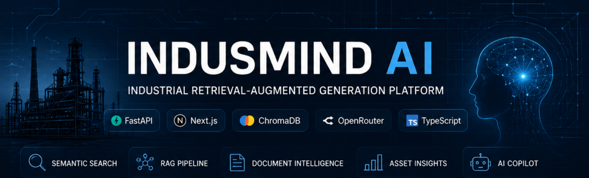
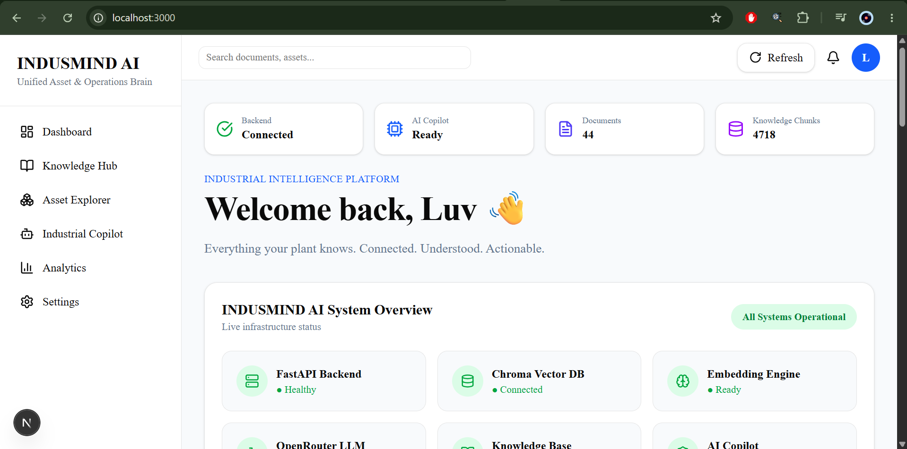
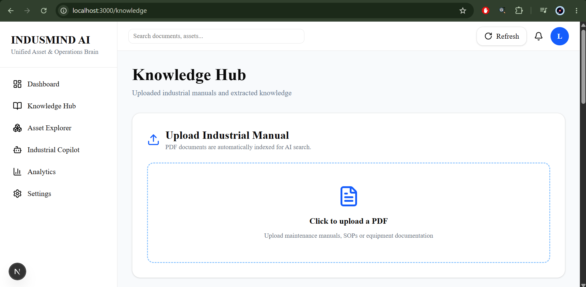
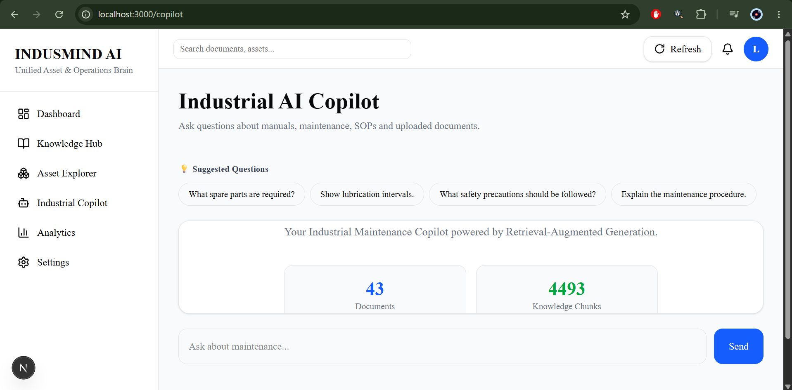
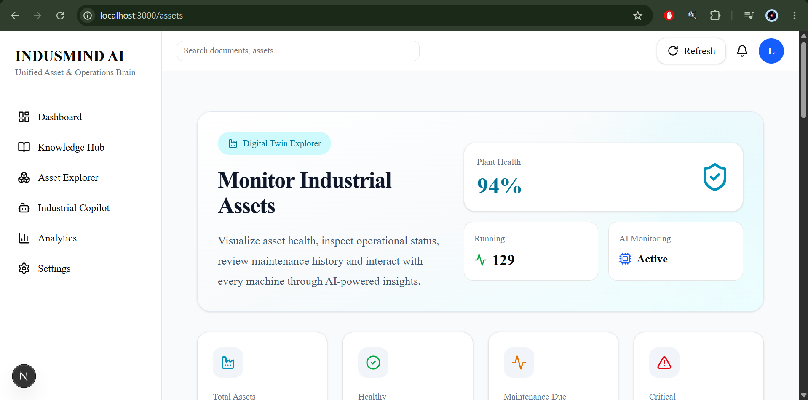
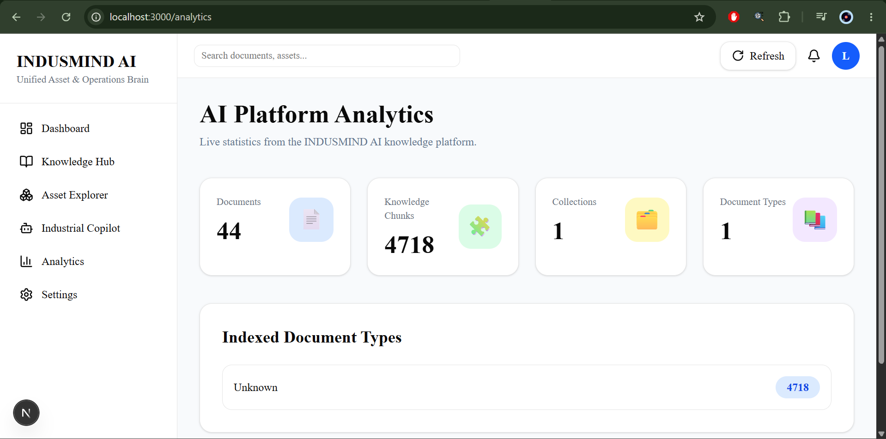
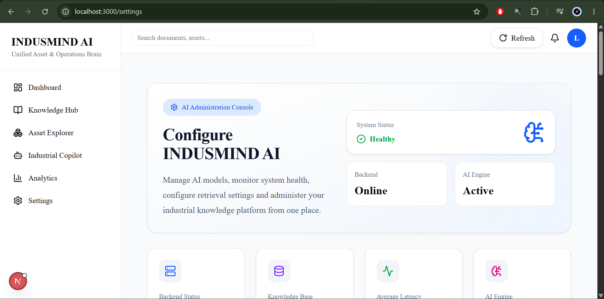

<p align="center">
  
</p>

<h1 align="center">INDUSMIND AI</h1>

<p align="center">
Industrial Retrieval-Augmented Generation Platform
</p>

<p align="center">


</p>

---

An industrial AI platform that combines Retrieval-Augmented Generation (RAG), semantic search and modern web technologies to help engineers interact with industrial documentation through natural language.

---

# INDUSMIND AI

An industrial AI assistant that combines Retrieval-Augmented Generation (RAG), semantic search and an interactive dashboard to help engineers interact with industrial documentation through natural language.

The platform ingests equipment manuals, operating procedures and maintenance documents, extracts structured knowledge, stores semantic embeddings in ChromaDB and enables intelligent question answering using Large Language Models.

---

## Overview

INDUSMIND AI was built to simplify the way engineers access technical knowledge.

Instead of manually searching through hundreds of pages of equipment documentation, users can upload industrial manuals and interact with them using natural language. The system retrieves relevant information using semantic search and generates context-aware responses through a Retrieval-Augmented Generation (RAG) pipeline.

The platform also provides a modern dashboard for monitoring the knowledge base, uploaded documents and system status.

---

## Features

### Knowledge Hub

- Upload industrial PDF manuals
- Automatic document parsing
- Knowledge extraction
- Semantic chunk generation
- ChromaDB indexing
- Equipment extraction
- Maintenance interval extraction

### Industrial Copilot

- Natural language question answering
- Retrieval-Augmented Generation (RAG)
- Context-aware responses
- OpenRouter LLM integration
- Document-grounded answers

### Asset Explorer

- Digital Twin inspired asset explorer
- Asset overview
- Equipment recommendations
- Asset documentation
- Maintenance insights

### Dashboard

- Knowledge statistics
- Indexed document metrics
- AI system status
- Recent activities
- Recommendations
- Alerts
- Knowledge growth visualization

### Analytics

- Knowledge base analytics
- Document statistics
- Embedding statistics
- Collection insights

### Settings

- AI configuration
- Knowledge base configuration
- Diagnostics
- Application preferences

---

# System Architecture

```text
                Industrial PDF Manuals
                          │
                          ▼
                 Document Upload API
                          │
                          ▼
               Document Parsing & OCR
                          │
                          ▼
                 Text Chunk Generation
                          │
                          ▼
             SentenceTransformer Embeddings
                          │
                          ▼
                     ChromaDB
                          │
                          ▼
                  Semantic Retrieval
                          │
                          ▼
                  OpenRouter LLM
                          │
                          ▼
                 Industrial Copilot
```

---

## Technology Stack

### Frontend

- Next.js 16
- React
- TypeScript
- Tailwind CSS
- shadcn/ui
- Lucide React
- Axios

### Backend

- FastAPI
- Python
- ChromaDB
- Sentence Transformers
- OpenRouter
- PyMuPDF
- OCR Pipeline

---

## Project Structure

```
INDUSMIND-AI
│
├── backend
│   ├── app
│   │   ├── agents
│   │   ├── api
│   │   ├── chunking
│   │   ├── embeddings
│   │   ├── ingestion
│   │   ├── knowledge_pipeline
│   │   ├── llm
│   │   ├── parser
│   │   ├── rag
│   │   ├── services
│   │   ├── vectorstore
│   │   └── main.py
│   │
│   ├── uploads
│   └── requirements.txt
│
├── frontend
│   ├── app
│   ├── components
│   ├── context
│   ├── data
│   ├── hooks
│   ├── services
│   ├── stores
│   ├── types
│   └── package.json
│
└── README.md
```

---

# Installation

## Clone the repository

```bash
git clone https://github.com/Luvsingh107/INDUSMIND-AI.git

cd INDUSMIND-AI
```

---

## Backend Setup

```bash
cd backend
```

Create a virtual environment

```bash
python -m venv .venv
```

Linux / macOS

```bash
source .venv/bin/activate
```

Windows

```bash
.venv\Scripts\activate
```

Install dependencies

```bash
pip install -r requirements.txt
```

---

## Environment Variables

Create a `.env` file inside the backend directory.

Example:

```env
OPENROUTER_API_KEY=your_api_key
```

Add any additional variables required by your backend configuration.

---

## Start Backend

```bash
uvicorn app.main:app --reload
```

Backend runs on

```
http://localhost:8000
```

---

## Frontend Setup

```bash
cd frontend
```

Install dependencies

```bash
npm install
```

---

## Start Frontend

```bash
npm run dev
```

Frontend runs on

```
http://localhost:3000
```

---

## Build for Production

Frontend

```bash
npm run build
```

Backend

```bash
uvicorn app.main:app
```

---

## Project Status

Current implementation includes:

- Document upload pipeline
- Knowledge extraction
- Semantic search
- Retrieval-Augmented Generation
- Industrial dashboard
- Asset Explorer
- Analytics
- Industrial Copilot
- Knowledge Hub
- Settings
- FastAPI backend
- Next.js frontend

---

# API Overview

The frontend communicates with the FastAPI backend through REST APIs.

| Method | Endpoint | Description |
|----------|--------------------------|---------------------------------------------|
| GET | `/dashboard/stats` | Dashboard statistics |
| POST | `/documents/upload` | Upload industrial document |
| GET | `/knowledge/documents` | Retrieve indexed documents |
| POST | `/chat` | Query the Industrial Copilot |
| GET | `/assets` | Retrieve asset information |

> The exact endpoints may vary depending on backend configuration.

---

# Application Workflow

```text
Upload PDF
      │
      ▼
Document Parsing
      │
      ▼
Text Chunking
      │
      ▼
Embedding Generation
      │
      ▼
Store in ChromaDB
      │
      ▼
User Query
      │
      ▼
Semantic Retrieval
      │
      ▼
OpenRouter LLM
      │
      ▼
Context Aware Response
```

---

# Screenshots

The following screenshots can be added after deployment.

```
docs/
└── screenshots
    ├── dashboard.png
    ├── knowledge.png
    ├── copilot.png
    ├── assets.png
    ├── analytics.png
    └── settings.png
```

Example:

## Dashboard



---

## Knowledge Hub



---

## Industrial Copilot



---

## Asset Explorer



---

## Analytics



---

## Settings



---

# Future Improvements

Some improvements planned for future versions include:

- Multi-user authentication
- Role based access control
- Real-time asset monitoring
- Predictive maintenance models
- Multi-document conversations
- Voice-based interaction
- Cloud deployment
- Docker support
- CI/CD pipeline
- Industrial IoT integration

---

# Known Limitations

- Supports PDF documents only.
- Responses depend on the uploaded knowledge base.
- Large documents may take additional time during indexing.
- Authentication has not been implemented.

---

# Contributing

Contributions are welcome.

If you would like to improve the project:

1. Fork the repository.
2. Create a feature branch.
3. Commit your changes.
4. Push the branch.
5. Open a Pull Request.

---

# Author

**Luvsingh Rajput**

B.Tech Computer Science and Engineering

Visvesvaraya National Institute of Technology, Nagpur

GitHub: https://github.com/Luvsingh107

---

# License

This project is licensed under the MIT License.

See the `LICENSE` file for details.